# Социальная сеть (аналог ВКонтакте): проектирование высоконагруженной системы

## 1. Тема и аудитория

**Сервис:** социальная сеть без мессенджера.

**MVP:**

1. Регистрация, авторизация, профиль
2. Друзья: заявка, принятие, список, удаление
3. Посты (текст + фото): создание, просмотр, удаление
4. Новостная лента (друзья + свои посты)
5. Лайки (1 на пост, можно снять)
6. Комментарии: добавление, просмотр, удаление
7. Сообщества: создание, вступление, просмотр

**Аудитория** [[1]](#source1):

| Показатель | Значение |
| --- | --- |
| География | Россия |
| MAU | 94,3 млн |
| DAU | 65,2 млн |
| Период | II квартал 2026 |

## 2. Расчет нагрузки

Пик = 2× средней. Время в сети - 64 мин/сутки на пользователя [[2]](#source2).

### Действия пользователя в день

| Запрос | Действий/день | Тип |
| --- | --- | --- |
| Загрузка ленты | 15 | чтение |
| Открытие поста | 8 | чтение |
| Просмотр профиля | 5 | чтение |
| Список друзей | 2 | чтение |
| Просмотр сообщества | 1 | чтение |
| Отдача фото (CDN) | 40 | чтение |
| Лайк | 3 | запись |
| Комментарий | 2 | запись |
| Создание поста | 0,15 | запись |
| Загрузка фото | 0,3 | запись |
| Заявка в друзья | 0,05 | запись |
| Редактирование профиля | 0,02 | запись |
| Вступление в сообщество | 0,01 | запись |

### Хранилище на пользователя

Средний размер файла фото - 150 КБ.

| Данные | Кол-во | Размер ед. | Итого |
| --- | --- | --- | --- |
| Фото | 300 | 150 КБ [[3]](#source3) | 45 МБ |
| Аватары | 10 | 100 КБ | 1 МБ |
| Посты | 100 | 1 КБ | 100 КБ |
| Комментарии | 200 | 200 Б | 40 КБ |
| Членство в сообществах | 30 | 5 КБ | 150 КБ |
| Дружба | 150 | 100 Б | 15 КБ |
| Лайки | 1 000 | 50 Б | 50 КБ |
| Профиль | 1 | 2 КБ | 2 КБ |
| **Итого** | | | **≈ 46 МБ** |

### Хранилище на всю аудиторию (94,3 млн), без репликации

| Данные | Единиц | Объем |
| --- | --- | --- |
| Фото | 28,3 млрд | 4,2 ПБ |
| Аватары | 0,94 млрд | 94 ТБ |
| Посты | 9,4 млрд | 9,4 ТБ |
| Комментарии | 18,9 млрд | 3,8 ТБ |
| Членство в сообществах | 2,8 млрд | 14,1 ТБ |
| Дружба | 14,1 млрд | 1,4 ТБ |
| Лайки | 94,3 млрд | 4,7 ТБ |
| Профили | 94,3 млн | 0,19 ТБ |
| **Итого** | | **≈ 4,4 ПБ** |

Текстовые данные (без фото и аватаров): ≈ 34 ТБ. Сравнение: хранилище фото VK ≈ 250 ПБ без репликации (вся база сервиса); наш расчет - модель MVP на активную аудиторию.

### Сетевой трафик

Размер ответа: лента 50 КБ, пост 20 КБ, профиль/друзья/сообщество 10 КБ, фото 150 КБ; загрузка фото 2 МБ.

| Трафик | В сутки | Средняя полоса | Пик (2×) |
| --- | --- | --- | --- |
| Фото (отдача) | 391 ТБ | 36 Гбит/с | 72 Гбит/с |
| Лента | 49 ТБ | 4,5 Гбит/с | 9 Гбит/с |
| Посты | 10 ТБ | 1,0 Гбит/с | 2 Гбит/с |
| Профили, друзья, сообщества | 5 ТБ | 0,5 Гбит/с | 1 Гбит/с |
| Фото (загрузка) | 39 ТБ | 3,6 Гбит/с | 7 Гбит/с |
| Текст (загрузка) | 2 ТБ | 0,2 Гбит/с | 0,4 Гбит/с |
| **Итого** | **≈ 496 ТБ** | **≈ 46 Гбит/с** | **≈ 91 Гбит/с** |

Фото - ≈ 79 % трафика, отдаются CDN.

### RPS

RPS = DAU × действий/день / 86 400.

| Метод | Средний | Пик (2×) |
| --- | --- | --- |
| Лента | 11 300 | 22 600 |
| Открытие поста | 6 000 | 12 100 |
| Фото (CDN) | 30 200 | 60 400 |
| Лайк | 2 300 | 4 500 |
| Комментарий | 1 500 | 3 000 |
| Профиль | 3 800 | 7 500 |
| Список друзей | 1 500 | 3 000 |
| Сообщество | 800 | 1 500 |
| Создание поста | 110 | 230 |
| Загрузка фото | 230 | 450 |
| Заявка в друзья | 40 | 75 |
| Редактирование профиля | 15 | 30 |
| Вступление в сообщество | 8 | 15 |
| **Итого** | **57 803** | **115 400** |

Чтение - ≈ 93 % запросов.

## 3. Глобальная балансировка нагрузки

### 3.1. Группы трафика

| Группа | Запросы | Средний RPS | Пик RPS | Объем/сутки | Доля RPS | Доля трафика |
| --- | --- | --- | --- | --- | --- | --- |
| Медиа | Фото | 30 200 | 60 400 | 391 ТБ | 52 % | 79 % |
| Динамическое чтение | Лента, пост, профиль, друзья, сообщество | 23 400 | 46 700 | 64 ТБ | 40 % | 13 % |
| Запись | Лайк, комментарий, пост, фото, заявка, профиль, сообщество | 4 200 | 8 300 | 41 ТБ | 7 % | 8 % |


### 3.2. Расположение ДЦ

Хранилище строится на 3 ДЦ, цель - пережить отказ 1 из 3 ДЦ.

Доли пользователей по ДЦ:

| ДЦ | Регионы | Доля | Пик RPS (без CDN) | Чтение | Запись |
| --- | --- | --- | --- | --- | --- |
| Москва | Центр, Юг, Сев. Кавказ, Поволжье | 65 % | 35 750 | 30 355 | 5 395 |
| Санкт-Петербург | Северо-Запад | 17 % | 9 350 | 7 939 | 1 411 |
| Новосибирск | Урал, Сибирь, Дальний Восток | 18 % | 9 900 | 8 406 | 1 494 |

Расчет доли: города Москва (25 %) и Санкт-Петербург (13 %) - по доле посетителей VK; остальные 62 % - пропорционально населению округов.

RTT:

| Маршрут | RTT |
| --- | --- |
| Москва ↔ Владивосток | 114 мс |
| Москва ↔ Красноярск / Омск | 53 / 42 мс | 
| Москва ↔ Новосибирск | ≈ 48 мс |
| Владивосток → Новосибирск | ≈ 66 мс | 
| Москва ↔ Санкт-Петербург | ≈ 9 мс |
| Санкт-Петербург ↔ Новосибирск | ≈ 57 мс |

### 3.3. Маршрутизация пользователя в ДЦ

| Группа | Механизм | Результат |
| --- | --- | --- |
| Медиа | BGP Anycast → ближайший CDN-узел / регион-кеш | кеш на узле, промах - в хранилище |
| Динамика | BGP Anycast, общий IP из 3 ДЦ → ближайший ДЦ | запрос обслуживается в ближайшем ДЦ |

Механизм: BGP Anycast - ближайший ДЦ по топологии; общие IP на фронтах, anycast в кеш-серверах 

Регион пользователя VK определяет по BGP-префиксам, запасной вариант - GeoIP. 

Минус anycast: обрыв соединения при перескоке между ДЦ - допустим, запросы короткие (запрос-ответ).

### 3.4. Данные между ДЦ: запись без пересылки в центральный master

Геошардирование по домашнему ДЦ (home-DC).

| Элемент | Решение |
| --- | --- |
| Шардирование | по `user_id`, ≈ 8 000 виртуальных шардов (как у VK), один master на шард |
| Home-DC | по региону при регистрации (BGP/GeoIP), хранится в профиле |
| Master шарда | в home-DC пользователя |
| Запись | в ближайший ДЦ → master в этом же ДЦ; запись пользователя вне home-региона проксируется в home-DC |
| Чтение | локальная реплика в любом ДЦ |
| Репликация | асинхронная, binlog, шард - во все 3 ДЦ |
| Копий шарда | 4: master + реплика в home-DC + по 1 в двух других ДЦ |
| Лаг репликации | ≈ 1 с, 99 % времени < 3 с |
| Read-your-writes | пользователь читает свой шард в home-DC |

Куда пишется действие (всегда в шард автора действия):

| Действие | Шард | Видно в других ДЦ |
| --- | --- | --- |
| Пост | автора | репликация |
| Лайк | лайкнувшего | репликация, счетчик - сумма по шардам, eventual consistency |
| Комментарий | автора комментария | репликация |
| Заявка в друзья | отправителя | репликация |
| Принятие заявки | принявшего | репликация |
| Профиль, вступление в сообщество | пользователя | репликация |

Запись вне home-региона: ≈ 2 % = 166 зап/с на пике; при 10 % - 830 зап/с.

Нагрузка записи по ДЦ (пик):

| ДЦ | Записей/с (master) | Поток репликации (1 КБ/запись) |
| --- | --- | --- |
| Москва | 5 395 | 5,4 МБ/с на получателя |
| Санкт-Петербург | 1 411 | 1,4 МБ/с на получателя |
| Новосибирск | 1 494 | 1,5 МБ/с на получателя |

Фото: по 1 копии в каждом ДЦ (RF = 3), как в VK; свежие данные - копии, затем erasure-кодирование; в VK ≈ 25 % изображений дедуплицируется. Объем при RF = 3: 4,2 ПБ × 3 ≈ 12,7 ПБ.

Задержка записи пользователя из Владивостока:

| Схема | Сеть |
| --- | --- |
| Единый master в Москве | ≈ 114 мс |
| Home-DC (Новосибирск) | ≈ 66 мс |

Отказ ДЦ:

| Параметр | Значение |
| --- | --- |
| Отключение | снятие BGP-анонса |
| Шарды упавшего ДЦ | promote реплики в другом ДЦ |
| RPO | лаг репликации, ≈ 1–3 с |
| RTO | цель ≤ 5 мин |
| Мощность | п. 4.6 |

## 4. Локальная балансировка нагрузки (внутри ДЦ)

### 4.1. Схема

```
Интернет
  │  BGP Anycast (общий IP)
  ▼
Маршрутизаторы ДЦ: ECMP (routing-балансировка)
  ▼
L7: nginx-фронты (каждый анонсирует IP по BGP, self-check)
  │  TLS-терминация, пул backend по типу запроса (general / mobile / api)
  ▼
Application: stateless, bare metal, пулы general / mobile / api
  │  локальный RPC-proxy (service discovery, шарды, circuit breaker)
  ▼                      ▼
Кеш (memcached)     БД: виртуальные шарды (master + реплики)
```

| Уровень | Технология | Режим |
| --- | --- | --- |
| Вход | ECMP по BGP | равномерно по nginx-фронтам |
| L7 | nginx | active/active |
| Application | kPHP-подобные backend на bare metal | active/active, пулы |
| Прокси к кешу и БД | локальный RPC-proxy на каждом сервере | конфиг кластеров и шардов |
| Кеш | memcached | шардирование на клиенте |
| БД | шарды | master + реплики |

### 4.2. Выбор способа балансировки на входе

**BGP/ECMP + L7 nginx** фронты анонсируют общие IP; горизонтальное масштабирование; L7: TLS, пулы, retry 

ECMP: при смене состава фронтов хеш перераспределяет часть соединений - используется resilient hashing на маршрутизаторах.

### 4.3. Алгоритмы по уровням

| Участок | Алгоритм |
| --- | --- |
| Маршрутизатор → nginx | ECMP (hash 5-tuple) |
| nginx → application | Least connections |
| Application → кеш | Consistent hash (ketama) по ключу |
| Application → БД (запись) | `user_id` → виртуальный шард → master |
| Application → БД (чтение) | Least connections по репликам шарда |
| CDN-узлы | hash по id контента |

Sticky sessions не используются: application stateless.

### 4.4. Отказоустойчивость

| Параметр | Значение |
| --- | --- |
| Health-check фронта | self-check демон на узле: локальный `GET /ping` раз в 1 с, 3 неудачи - снятие BGP-анонса (≈ 3–5 с) |
| Failover L7 | `proxy_next_upstream error timeout http_502 http_503`; VK также повторяет запрос на другом backend |
| Попыток | `proxy_next_upstream_tries 2`, `proxy_next_upstream_timeout 2s` |
| Запись (POST) | повтор только при ошибке соединения |
| Application → шард | RPC-proxy: определение отказа, circuit breaker |
| Реестр экземпляров | конфиг-менеджмент + RPC-proxy |
| Размещение | серверы по ≥ 3 машинным залам ДЦ |

Таймауты upstream (по квантилям):

| Запрос | Таймаут |
| --- | --- |
| Лайк, комментарий | 300 мс |
| Профиль, друзья, пост | 500 мс |
| Лента | 1 с |
| Загрузка фото | 30 с |

### 4.5. Балансировка внутри проекта

| Трафик | Способ |
| --- | --- |
| Внешний | ECMP → nginx (п. 4.1) |
| Межсервисный | локальный RPC-proxy на клиенте (sidecar-подход) |
| К кешу и БД | клиентская балансировка: consistent hash / шард |

### 4.6. Расчет мощности

Параметры:

| Параметр | Значение | Основание |
| --- | --- | --- |
| Application-узел | 1 000 RPS | 32 ядра / 30 мс CPU на запрос ≈ 1 070 RPS |
| nginx-узел (HTTPS, прокси) | 50 000 RPS | ≈ 20 % от бенчмарка NGINX: 236 703 RPS на 8 CPU (1 КБ, Ingress) |
| Master шарда | 1 000 записей/с | Facebook 2011: ≈ 33 000 QPS на MySQL-сервер |
| Загрузка на пике | ≤ 60 % | рекомендация 60–70 % для latency-sensitive сервисов |
| Загрузка при отказе ДЦ | ≤ 85 % | |
| Hit ratio кеша | 96 % | TAO: 96,4 % |

Нагрузка без отказов:

| | Москва | Санкт-Петербург | Новосибирск | Итого |
| --- | --- | --- | --- | --- |
| Пик RPS | 35 750 | 9 350 | 9 900 | 55 000 |
| Исходящий трафик динамики, Гбит/с | 7,8 | 2,0 | 2,2 | 12 |
| nginx: расчет (RPS / 30 000) | 1,2 | 0,3 | 0,3 | |
| nginx: с резервом N+1 | 3 | 2 | 2 | 7 |
| Application: расчет (RPS / 600) | 60 | 16 | 17 | 93 |
| Чтение в БД (4 % от чтения) | 1 214 | 318 | 336 | 1 868 |
| Запись в БД | 5 395 | 1 411 | 1 494 | 8 300 |
| Master-шарды (запись / 600) | 9 | 3 | 3 | 15 |

Данные: текстовые ≈ 34 ТБ (без фото) на копию; при 15 master-серверах ≈ 2 ТБ на сервер на копию.

Мощность с учетом отказа любого одного ДЦ (остальные ≤ 85 %: 55 000 / 850 ≥ 65 узлов в двух оставшихся ДЦ):

| | Москва | Санкт-Петербург | Новосибирск | Итого |
| --- | --- | --- | --- | --- |
| Application-узлов | 60 | 33 | 33 | 126 |

| Отказал | Остальные: узлов | Загрузка остальных |
| --- | --- | --- |
| Москва | 33 + 33 = 66 | 83 % |
| Санкт-Петербург | 60 + 33 = 93 | 59 % |
| Новосибирск | 60 + 33 = 93 | 59 % |

При отказе Москвы доли перераспределяются через BGP (prepend/communities): Санкт-Петербург ≈ 28 000 RPS (85 %), Новосибирск ≈ 27 000 RPS (82 %).

### 4.7. Функциональное разделение по доменам

| Домен | Трафик | Пик RPS | Балансировка |
| --- | --- | --- | --- |
| `static` | JS, CSS, иконки | в составе медиа | CDN, кеш |
| `media` | отдача фото | 60 400 | CDN, anycast, hash по id контента |
| `upload` | загрузка фото | 450 | ближайший ДЦ (home-DC), отдельный пул, таймаут 30 с |
| `api` | клиентские приложения | в составе динамики | nginx → пул api |
| `m` | мобильная версия | в составе динамики | nginx → пул mobile |
| основной | веб: лента, посты, профили | в составе динамики (≈ 54 550 без upload) | nginx → пул general |

Что дает: независимое масштабирование и изоляция отказов по доменам; статика и медиа без cookie и вне application-серверов.

Минусы: сложнее администрирование, есть риск упереться в неделимый кусок (лента: основной трафик идет в один пул).

## 5. Логическая схема БД

СУБД - реляционная MySQL-подобная. Правила шардинга: без JOIN, транзакций, триггеров и хранимых процедур, денормализация, поиск только по индексу, шардинг по первичному ключу. Все ссылки между таблицами - логические (без FOREIGN KEY): таблицы лежат на разных шардах.

### 5.1. ER-диаграмма




### 5.2. Сущности


Нагрузка по таблицам (до кеша; в БД доходит ≈ 4 % чтения):

| Таблица | Поля | Размер строки | Чтение, RPS | Запись, RPS |
| --- | --- | --- | --- | --- |
| `users` | id BIGINT, email VARCHAR, password_hash VARCHAR, name VARCHAR, birth_date DATE, avatar_id BIGINT, home_dc TINYINT, created_at/last_login DATETIME | 2 КБ | 7 500 (профиль) + 3 000 (вход) = 10 500 | 30 (редактирование профиля) |
| `sessions` | session_id CHAR(64), user_id BIGINT, device VARCHAR, expires_at DATETIME | ≈ 200 Б | 55 000 (каждый динамический запрос) | 3 000 (вход) |
| `friendships` | user_id, friend_id BIGINT, status TINYINT (заявка / друзья), created_at DATETIME | 100 Б | 22 600 (лента) + 3 000 (список друзей) = 25 600 | 75 (заявка) × 2 (строка у отправителя и у получателя) = 150 |
| `posts` | id BIGINT, author_id BIGINT, community_id BIGINT NULL, text TEXT, photo_ids JSON, author_name VARCHAR, author_avatar_id BIGINT, created_at DATETIME | 1 КБ | 22 600 (лента) + 12 100 (пост) + 7 500 (профиль) = 42 200 | 230 (создание поста) |
| `post_stats` | post_id BIGINT, likes_count INT, comments_count INT | ≈ 20 Б | 22 600 (лента) + 12 100 (пост) = 34 700 | 4 500 (лайк) + 3 000 (комментарий) = 7 500 |
| `likes` | user_id, post_id BIGINT, created_at DATETIME | ≈ 50 Б | 22 600 (лента) + 12 100 (пост) = 34 700 | 4 500 (лайк) |
| `comments` | id BIGINT, post_id BIGINT, author_id BIGINT, text VARCHAR(1000), author_name VARCHAR, created_at DATETIME | 200 Б | 12 100 (пост) | 3 000 (комментарий) |
| `photos` | id BIGINT, owner_id BIGINT, storage_key VARCHAR, size INT, created_at DATETIME | ≈ 200 Б | 12 100 (пост) | 450 (загрузка фото) |
| `communities` | id BIGINT, name VARCHAR, description TEXT, owner_id BIGINT, members_count INT, created_at DATETIME | ≈ 1 КБ | 1 500 (сообщество) | 15 (счетчик участников при вступлении) |
| `community_members` | community_id, user_id BIGINT, role TINYINT, joined_at DATETIME | 5 КБ | 1 500 (сообщество) | 15 (вступление) |

### 5.3. Требования к консистентности

| Уровень | Таблицы | Почему |
| --- | --- | --- |
| Strong | `users`, `sessions` | логин, права доступа, читаем из master в home-DC |
| Causal | `friendships`, `community_members` | принятие заявки не раньше самой заявки; участник не появляется в сообществе, которого еще не видно |
| Eventual | `posts`, `comments`, `likes`, `post_stats`, `photos`, `communities` | асинхронная репликация между ДЦ, счетчики - сумма по шардам, автор видит свои данные сразу |

### 5.4. Шардирование и ключи

Все таблицы - виртуальные шарды (≈ 8 000), один master на шард в home-DC. Запись всегда идет в шард автора действия.

| Таблица | Первичный ключ | Ключ шардирования | Почему |
| --- | --- | --- | --- |
| `users` | `id` | `id` | вся работа с пользователем в одном шарде |
| `sessions` | `session_id` | `user_id` | сессии пользователя рядом с профилем; разбор по токену - через кеш |
| `friendships` | (`user_id`, `friend_id`) | `user_id` | список друзей - один шард |
| `posts` | `id` | `author_id` | стена автора и сборка ленты - по шардам друзей |
| `likes` | (`user_id`, `post_id`) | `user_id` | запись в шард лайкнувшего; снять лайк - одна строка |
| `comments` | `id` | `author_id` | запись в шард автора |
| `photos` | `id` | `owner_id` | фото пользователя в его шарде |
| `communities` | `id` | `id` | |
| `community_members` | (`community_id`, `user_id`) | `user_id` | список сообществ пользователя - один шард; список участников - через индекс |
| `post_stats` | `post_id` | `post_id` | один счетчик на пост; обновляется асинхронно |

`id` - BIGINT, генерируется по схеме «номер шарда + последовательность» (snowflake-подобно), чтобы по `id` определять шард без обращения к БД; для `users`, `posts`, `comments`, `photos` в `id` зашит шард автора.

### 5.5. Индексы

Поиск только по индексу.

| Таблица / индекс | Ключ | Шардирование | Для чего |
| --- | --- | --- | --- |
| `users` | UNIQUE `email` | сквозной индекс `email → user_id` | логин |
| `posts` | (`author_id`, `created_at` DESC) | локальный, в шарде автора | стена, сборка ленты |
| `posts_by_community` | (`community_id`, `created_at` DESC) → `post_id` | по `community_id` | посты сообщества |
| `friendships` | (`friend_id`, `status`) | сквозной, по `friend_id` | входящие заявки |
| `likes_by_post` | `post_id` → `user_id` | по `post_id` | кто лайкнул пост; пересчет счетчика |
| `comments_by_post` | (`post_id`, `created_at`) → `comment_id`, `author_id` | по `post_id` | комментарии под постом (иначе пришлось бы опрашивать все шарды) |
| `community_members_by_community` | `community_id` → `user_id` | по `community_id` | участники сообщества |
| `sessions` | `user_id` | локальный | выход со всех устройств |

### 5.6. Денормализация

| Что | Куда | Зачем |
| --- | --- | --- |
| `author_name`, `author_avatar_id` | `posts` | вывод поста и ленты без чтения `users` с другого шарда |
| `author_name` | `comments` | то же для комментариев |
| `likes_count`, `comments_count` | `post_stats` | не считать `COUNT(*)` по шардам при выводе ленты |
| `members_count` | `communities` | то же для сообщества |
| `photo_ids` (JSON) | `posts` | пост со всеми фото - одним чтением |


### 5.7. Лента

Лента не хранится отдельной таблицей, собирается на чтении:

1. Читаем список друзей из `friendships` (шард пользователя).
2. Параллельно читаем последние посты друзей по индексу (`author_id`, `created_at`) из шардов авторов (локальные реплики в ближайшем ДЦ).
3. Склеиваем в приложении, берем верх по `created_at`, добираем `post_stats` и флаги лайков.
4. Результат кладется в memcached на короткое время (ключ `feed:{user_id}`).

## Источники

1. <a id="source1"></a>[VK - результаты за II квартал 2026 года](https://vk.company.ru/ru/investors/info/12383/) - MAU, DAU.
2. <a id="source2"></a>[VK - 64 минуты в сутки](https://vk.ru/press/timespent-december-2025) - время в сети.
3. <a id="source3"></a>[Эволюция хранилища ВКонтакте](https://habr.com/ru/companies/vk/articles/905152/) - средний файл фото ≈ 150 КиБ, 250 ПБ фото, 3 ДЦ, RF = 3, дедупликация ≈ 25 %.
4. <a id="source4"></a>[FAQ по архитектуре ВКонтакте](https://habr.com/ru/companies/oleg-bunin/articles/449254/) - фронты nginx с общими IP, регион по BGP-префиксам, anycast, ketama, RPC-proxy.
5. <a id="source5"></a>[TAO: Facebook's Distributed Data Store (USENIX ATC 2013)](https://www.usenix.org/system/files/conference/atc13/atc13-bronson.pdf) - запись через master-регион 74,4 мс против 12,1 мс, hit ratio 96,4 %, лаг ≈ 1 с.
6. <a id="source6"></a>[iKS-Media - Пиринг для облаков](https://www.iksmedia.ru/articles/5630138-Piring-dlya-oblakov.html) - RTT от Москвы: Владивосток 114, Красноярск 53, Омск 42 мс.
7. <a id="source7"></a>Быков А. Проектирование высоконагруженных систем, лекция 5 «Масштабирование баз данных» - правила шардинга, денормализация, сквозные индексы.
